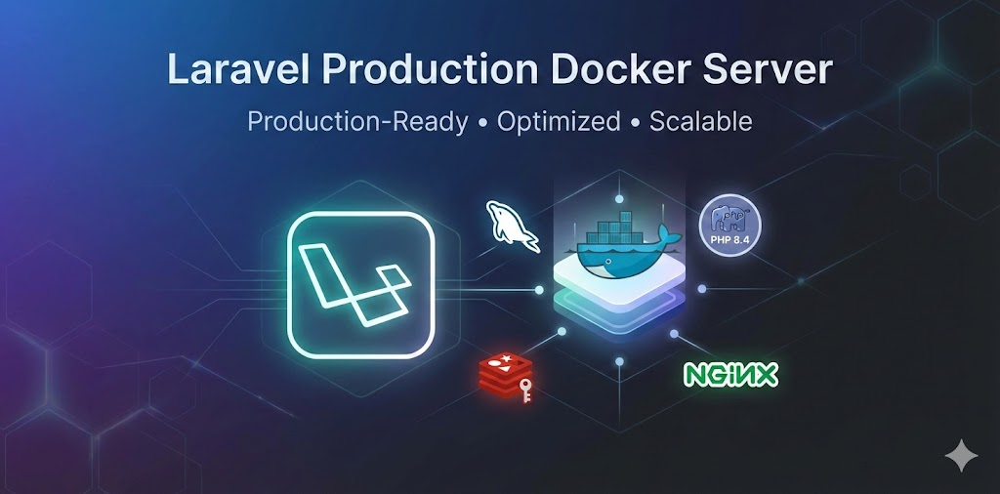

<p align="center">
  
</p>

# Laravel Production Docker Server

A production-ready Dockerised environment for running Laravel applications. This stack is optimised for high-performance hosting on dedicated servers.

> **⚠️ Security Notice:** Before deploying to production, please review [SECURITY.md](SECURITY.md) for critical security configurations including HTTPS setup, password changes, and firewall rules.

## � Quick Start
### Automated Setup (Recommended)

The easiest way to get started is with the interactive setup script:

```bash
# Clone the repository
git clone https://github.com/DanJamesMills/laravel-production-docker.git
cd laravel-production-docker

# Run the interactive setup script
./setup.sh
```

**The setup script will:**
- ✅ Verify Docker installation
- ✅ Select PHP version (8.1, 8.2, 8.3, or 8.4)
- ✅ Configure MySQL based on your server's RAM (2GB, 4GB, 8GB, 16GB, or custom)
- ✅ Set up your domain and HTTPS preferences
- ✅ Generate secure passwords for MySQL and Redis
- ✅ Optionally install a fresh Laravel application
- ✅ Optionally install Laravel starter kits (React, Vue, or Livewire)
- ✅ Create and start all Docker containers
- ✅ Run database migrations (if Laravel installed)

**Setup takes ~5 minutes** and handles all configuration automatically.

---

### Manual Setup (Advanced)

If you prefer manual configuration or want more control:
### Prerequisites

**Required:**
- **Docker Engine** 20.10+ ([Install Docker](https://docs.docker.com/engine/install/))
- **Docker Compose** 2.0+ (included with Docker Desktop)
- 4GB+ RAM server (recommended)
- Git (for cloning repositories)

**Verify Docker is installed:**
```bash
docker --version
docker compose version
```

**Knowledge:**
- Basic understanding of Docker and Docker Compose
- Familiarity with Laravel applications

#### 1. Clone & Configure

```bash
# Clone or download this repository
cd "Laravel Production"

# Create environment file
cp .env.example .env

# Edit .env and set your database passwords (REQUIRED!)
# The defaults are placeholders - change them before running
nano .env
```

#### 2. Configure Domain

Edit [config/vhosts/default.conf](config/vhosts/default.conf) and set your domain:
```nginx
server_name your-domain.local;  # Change this
```

#### 3. Start Docker Stack

```bash
# Build and start all containers
docker compose up -d --build

# Check all containers are healthy
docker compose ps
```

#### 4. Add Your Laravel Application

Place your Laravel app in the `./app` directory:

```bash
# Option 1: Clone existing project
git clone your-laravel-repo.git app

# Option 2: Create new Laravel project
composer create-project laravel/laravel app

# Option 3: Copy existing application
cp -r /path/to/your/laravel-app ./app
```

#### 5. Configure Laravel

```bash
# Copy Laravel environment file
cp ./app/.env.example ./app/.env

# Edit to match Docker database settings
nano ./app/.env
```

Required Laravel `.env` settings:
```ini
DB_CONNECTION=mysql
DB_HOST=mysql
DB_PORT=3306
DB_DATABASE=laravel_production
DB_USERNAME=laravel_user
DB_PASSWORD=ChangeThisToAStrongRandomPassword456!
```

#### 6. Install & Setup

```bash
# Install PHP dependencies
docker compose exec php composer install

# Install Node dependencies
docker compose exec php npm install

# Generate application key
docker compose exec php php artisan key:generate

# Run migrations
docker compose exec php php artisan migrate
```

#### 7. Access Your Application

- **Local:** `http://localhost`
- **Domain:** `http://your-domain.local` (if DNS configured)

That's it! Your Laravel application is now running in production mode. 🎉

> **📝 Note for macOS Users:** This stack is fully compatible with macOS using Docker Desktop. The setup script automatically detects your system's UID/GID (typically 501:20 on macOS) and configures containers accordingly. While Docker Desktop handles most file permission mapping automatically, we still map UID/GID to ensure consistent behavior across Linux and macOS environments, especially when deploying to production Linux servers.

---

## 📚 Detailed Documentation

Need more details? Jump to these sections:

- **[Compatibility & Versions](#-compatibility)** - Laravel, PHP, MySQL versions
- **[Architecture Overview](#-architecture)** - Stack components
- **[PHP Configuration](#-php-extensions--configuration)** - Customise PHP settings (1GB uploads, 4GB memory by default)
- **[MySQL Tuning](#-mysql-tuning-guide)** - Database performance (1GB buffer pool by default)
- **[Horizon & Scheduler](#-laravel-queue--scheduling-requirements)** - Queue workers (optional)
- **[Network Access](#3-network-access)** - Cloudflare Tunnel, SSH, direct access
- **[Self-Healing](#-self-healing-health-checks)** - Automatic container restart
- **[Resource Limits](#-resource-management)** - CPU/Memory configuration
- **[Security](#securitymd)** - HTTPS, firewall, best practices
- **[Troubleshooting](#️-troubleshooting)** - Common issues

---

## �📌 Compatibility

- **Laravel:** 8.x, 9.x, 10.x, 11.x (depending on PHP version chosen)
- **PHP:** 8.1, 8.2, 8.3, or 8.4 (selectable, defaults to 8.4)
- **Composer:** 2.x (latest, included in container)
- **MySQL:** 8.0
- **Redis:** 7.x
- **Node.js:** 20 LTS (for asset compilation)

> **Note:** Choose your PHP version during setup. Each version is optimised with all Laravel required extensions. The setup script will guide you through version selection based on your Laravel requirements.

## 🏗 Architecture

- **Webserver:** Nginx (Alpine) - Optimised with gzip, caching, security headers
- **App Engine:** PHP 8.1/8.2/8.3/8.4 (selectable) with all Laravel extensions (Redis, ImageMagick, GD, etc.)
- **Database:** MySQL 8.0 - Default: 1GB buffer pool, tunable for any server size
- **Cache/Queue:** Redis 7 with AOF persistence
- **Workers:** Laravel Horizon & Scheduler (optional, gracefully wait if Laravel not installed)

> **Defaults configured for 4GB RAM servers.** See [PHP Configuration](#-php-extensions--configuration) and [MySQL Tuning](#-mysql-tuning-guide) to customise.

## 🔧 PHP Extensions & Configuration

### Pre-installed Extensions

All PHP containers (8.1, 8.2, 8.3, 8.4) include the commonly required Laravel extensions:

**Core Extensions:**
- `pdo`, `pdo_mysql`, `mysqli`, `pdo_pgsql` - Database connectivity
- `mbstring`, `zip`, `exif`, `bcmath`, `intl`, `pcntl` - String & utility functions
- `gd` - Image manipulation (with FreeType & JPEG support)
- `opcache` - PHP bytecode caching

**Additional Extensions:**
- `redis` - Redis client
- `imagick` - Advanced image processing
- `xml` - XML parsing

### Default PHP Settings

Optimised for production Laravel applications:
- **Upload limit:** 1024MB (post_max_size & upload_max_filesize)
- **Memory limit:** 4096MB per request
- **Max execution time:** 300 seconds
- **Error display:** Disabled (errors logged only)
- **Session security:** HTTP-only cookies, strict mode enabled

> **Need to customise?** See [Customising PHP Configuration](#customising-php-configuration) below.

### Customising PHP Configuration

PHP configuration files are version-specific:
- **PHP 8.1:** `services/php-fpm/php8.1/php.ini`
- **PHP 8.2:** `services/php-fpm/php8.2/php.ini`
- **PHP 8.3:** `services/php-fpm/php8.3/php.ini`
- **PHP 8.4:** `services/php-fpm/php8.4/php.ini`

Default settings:
```ini
post_max_size = 1024M
upload_max_filesize = 1024M
memory_limit = 4096M
```

**To modify PHP settings:**

1. Edit the configuration file for your chosen PHP version:
   ```bash
   # Example for PHP 8.4
   nano services/php-fpm/php8.4/php.ini
   ```

2. Rebuild the PHP containers:
   ```bash
   docker compose build php horizon scheduler
   docker compose up -d
   ```

> **Note:** Changes to `php.ini` require rebuilding the image as the file is copied during the Docker build process.

### Switching PHP Versions

To change PHP versions after initial setup:

1. **Update `.env` file:**
   ```bash
   nano .env
   # Change: PHP_VERSION=8.4
   # To:     PHP_VERSION=8.2  (or 8.1, 8.3)
   ```

2. **Rebuild containers:**
   ```bash
   docker compose down
   docker compose build php horizon scheduler
   docker compose up -d
   ```

3. **Verify PHP version:**
   ```bash
   docker compose exec php php -v
   ```

> **Important:** Ensure your Laravel application is compatible with the PHP version you select. Check [Laravel's version compatibility](https://laravel.com/docs/deployment#server-requirements).

### Laravel Starter Kits

The setup script supports installing Laravel's official starter kits during initial installation.

**Available Starter Kits:**

1. **React** - Modern single-page app with React 19, Inertia, TypeScript, Tailwind, and shadcn/ui components
   - Built-in authentication with Laravel Fortify
   - Two-factor authentication support
   - Multiple layout variants (sidebar/header)
   - Type-safe routing with Wayfinder

2. **Vue** - Modern single-page app with Vue 3 Composition API, Inertia, TypeScript, Tailwind, and shadcn-vue components
   - Same robust features as React starter kit
   - Vue-optimized components and composables

3. **Livewire** - Dynamic, reactive PHP frontend with Livewire 4, Tailwind, and Flux UI components
   - No JavaScript framework needed
   - Perfect for PHP-focused teams
   - Server-rendered with reactive components

**Installation via setup script:**
When running `./setup.sh` and choosing to install Laravel, you'll be prompted to select a starter kit. The starter kit is installed during Laravel creation for optimal setup.

**Features included in all starter kits:**
- Complete authentication system (login, registration, password reset)
- Email verification
- Two-factor authentication (2FA)
- Profile management
- Password confirmation
- Rate limiting

Learn more: [Laravel Starter Kits Documentation](https://laravel.com/docs/starter-kits)

### Build Performance Tips

To speed up Docker builds:

1. **Enable BuildKit** (modern Docker builder with better caching):
   ```bash
   export DOCKER_BUILDKIT=1
   docker compose build
   ```

2. **Rebuild only what changed**:
   ```bash
   # Only rebuild PHP containers if Dockerfile/php.ini changed
   docker compose build php horizon scheduler
   
   # Or rebuild with no cache if having issues
   docker compose build --no-cache php
   ```

3. **Use layer caching**: The Dockerfile is optimised with separate layers - changing `php.ini` won't require reinstalling all PHP extensions.

## 📋 Laravel Queue & Scheduling Requirements

This stack includes **Laravel Horizon** and **Laravel Scheduler** containers. These are optional depending on your application needs:

### Laravel Horizon (Queue Worker)

**What it is:** Laravel Horizon provides a dashboard and configuration for Redis queues.

**When you need it:**
- Your app uses `dispatch()`, jobs, or queues
- You send emails/notifications asynchronously
- You process background tasks

**When you don't need it:**
- Simple CRUD applications without queues
- Synchronous processing only

**If you don't use queues:** Remove the `horizon` service from [docker-compose.yml](docker-compose.yml) or change it to a standard queue worker:
```yaml
horizon:
  # ... existing config ...
  command: php artisan queue:work --tries=3
```

### Laravel Scheduler

**What it is:** Runs scheduled tasks defined in `app/Console/Kernel.php`.

**When you need it:**
- You have scheduled tasks (cron jobs)
- Database cleanup, reports, backups, etc.

**When you don't need it:**
- No scheduled tasks in your application

**If you don't use scheduling:** Remove the `scheduler` service from [docker-compose.yml](docker-compose.yml).

### Installing Horizon

If you want to use Horizon:

```bash
# Install Horizon
docker compose exec php composer require laravel/horizon

# Publish Horizon assets
docker compose exec php php artisan horizon:install

# Run migrations
docker compose exec php php artisan migrate
```

Access Horizon dashboard at: `http://your-domain.local/horizon`

## � MySQL Tuning Guide

**Default configuration:** Optimised for a 4GB RAM server with 1GB buffer pool. Adjust based on your hardware:

**`MYSQL_INNODB_BUFFER_POOL_SIZE`** - The cache for your database tables and indexes
- **What it does:** Stores frequently accessed data in memory to avoid disk reads
- **How to set it:**
  - Dedicated DB server: 50-70% of total RAM
  - Shared server (with app): 25-40% of total RAM
- **Examples:**
  - 4GB RAM server: `1G` (default)
  - 8GB RAM server: `2G`
  - 16GB RAM server: `4G` 
  - 32GB RAM server: `8G`
  - 64GB RAM server: `16G`
  - 128GB RAM server: `32G`

**`MYSQL_INNODB_LOG_FILE_SIZE`** - Transaction log size
- **What it does:** Buffers database changes before writing to disk
- **Trade-off:** Larger = better write performance, but slower crash recovery
- **Recommendations:**
  - Low write volume: `256M` (default)
  - Medium write volume: `512M`
  - High write volume: `1G` or `2G`

**`MYSQL_INNODB_FLUSH_LOG_AT_TRX_COMMIT`** - Write durability vs speed
- **What it does:** Controls when transactions are written to disk
- **Options:**
  - `1` = **Safest** - Write to disk on every transaction (ACID compliant)
  - `2` = **Balanced** - Write to OS cache immediately, flush to disk every second (default)
  - `0` = **Fastest** - Write to log buffer, flush every second (risk of 1 second data loss)
- **When to use:**
  - `1`: Financial data, critical transactions
  - `2`: Most production applications (good balance)
  - `0`: Development, non-critical logging systems

> **💡 Tip:** Monitor your MySQL memory usage with:
> ```bash
> docker compose exec mysql mysql -u root -p -e "SHOW ENGINE INNODB STATUS\G" | grep "Buffer pool size"
> ```

## 🌐 Network Access Options

The application will be accessible on **port 80** of your server. Choose your access method:

**Option 1: Local DNS (Homelab)**
Create a DNS record pointing to your server's IP:
```
your-domain.local → 192.168.1.100
```

**Option 2: Cloudflare Tunnel (External Access)**

Expose your homelab to the internet securely using Docker:

1. **Create a tunnel in Cloudflare Dashboard:**
   - Go to [Cloudflare Zero Trust Dashboard](https://one.dash.cloudflare.com/) → Networks → Tunnels
   - Click "Create a tunnel" and follow the wizard
   - You'll get a tunnel token

2. **Run cloudflared via Docker:**
   ```bash
   docker run -d \
     --name cloudflared-tunnel \
     --restart unless-stopped \
     --network "laravel production_default" \
     cloudflare/cloudflared:latest tunnel \
     --no-autoupdate run \
     --token YOUR_TUNNEL_TOKEN_HERE
   ```

3. **Configure the tunnel in Cloudflare Dashboard:**
   - Public hostname: `yourdomain.com`
   - Service: `http://webserver:80` (if on same server) or `http://SERVER_IP:80` (if cloudflared runs on different server)

> **Note:** When cloudflared runs on the **same server** as your Laravel containers, use `--network "laravel production_default"` to access `webserver:80` by container name. If cloudflared runs on a **different server**, omit the `--network` flag and point to `http://YOUR_LARAVEL_SERVER_IP:80` instead.

Learn more: [Cloudflare Tunnel Documentation](https://developers.cloudflare.com/cloudflare-one/connections/connect-apps/)

**Option 3: Direct Access**
Access via IP: `http://192.168.1.100` (replace with your server's IP)

### Configuring Trusted Proxies

> **⚠️ Important:** If you're using a reverse proxy, load balancer, or Cloudflare Tunnel, you must configure Laravel to trust the proxy to ensure correct client IP addresses and HTTPS detection.

**Configure your Laravel application in `bootstrap/app.php`:**

```php
->withMiddleware(function (Middleware $middleware) {
    $middleware->trustProxies(at: [
        '192.168.1.1',
        '10.0.0.0/8',
    ]);
})
```

**To trust all proxies** (e.g., cloud load balancers):
```php
->withMiddleware(function (Middleware $middleware) {
    $middleware->trustProxies(at: '*');
})
```

**Configure proxy headers** (e.g., for Cloudflare or AWS ELB):
```php
->withMiddleware(function (Middleware $middleware) {
    $middleware->trustProxies(
        headers: Request::HEADER_X_FORWARDED_FOR | 
                 Request::HEADER_X_FORWARDED_HOST | 
                 Request::HEADER_X_FORWARDED_PORT | 
                 Request::HEADER_X_FORWARDED_PROTO
    );
})
```

Learn more: [Laravel Trusted Proxies Documentation](https://laravel.com/docs/master/requests#configuring-trusted-proxies)

## 🛠 Usage & Commands

All Laravel commands must be run inside the `php` container.

### 🐘 Artisan Commands

```bash
# Run migrations
docker compose exec php php artisan migrate

# Create controllers, models, etc.
docker compose exec php php artisan make:controller YourController
docker compose exec php php artisan make:model YourModel

# Laravel Tinker
docker compose exec php php artisan tinker
```

### 📦 Composer & NPM

```bash
# Update PHP dependencies
docker compose exec php composer update

# Build Frontend Assets (Production)
docker compose exec php npm run build

# Watch Frontend Assets (Development)
docker compose exec php npm run dev
```

### 🔍 Logs & Monitoring

View all logs:

```bash
docker compose logs -f
```

View specific service logs:

```bash
# Queue worker logs
docker compose logs -f horizon

# PHP application logs
docker compose logs -f php

# Database logs
docker compose logs -f mysql
```

### 🗄️ Database Access

**Accessing MySQL from GUI Tools (TablePlus, MySQL Workbench, etc.)**

**Recommended Method: SSH Tunnel**

Connect to your server via SSH and tunnel the MySQL port. This keeps the database secure and unexposed to the network:

```bash
# On your local machine
ssh -L 3306:localhost:3306 user@your-server-ip

# Then connect your GUI tool to:
# Host: localhost
# Port: 3306
# User: homelab
# Password: supersecret
```

**Alternative: Expose Port (Not Recommended for Production)**

You can expose MySQL port 3306 to the host, but **be careful** - this exposes your database to your network:

Edit [docker-compose.yml](docker-compose.yml) and add ports to the `mysql` service:

```yaml
mysql:
  image: mysql:8.0
  ports:
    - "3306:3306"  # ⚠️ CAUTION: Exposes database to network
  # ... rest of config
```

> **⚠️ Security Warning:** Only expose port 3306 if your server is behind a firewall and you trust your network. For production environments, always use SSH tunneling instead.

## 🚢 Production Deployment

Follow this checklist when deploying updates:

1. **Pull latest code:** `git pull origin main`
2. **Rebuild containers:** `docker compose up -d --build`
3. **Install dependencies:** `docker compose exec php composer install --no-dev`
4. **Build assets:** `docker compose exec php npm run build`
5. **Run migrations:** `docker compose exec php php artisan migrate --force`
6. **Cache config:**
   ```bash
   docker compose exec php php artisan config:cache
   docker compose exec php php artisan route:cache
   docker compose exec php php artisan view:cache
   ```
7. **Restart workers:** `docker compose restart horizon scheduler`

## ⚠️ Troubleshooting

### 1. "Connection Refused" on Startup

**Cause:** MySQL is still initializing its memory pool.

**Fix:** Wait 30 seconds. The healthcheck will automatically start PHP containers once MySQL is ready.

### 2. Permissions Issues

**Cause:** File ownership mismatch between host and container.

**Fix:** The containers use UID:1000 by default. Ensure your host user has UID 1000, or set `UID` and `GID` in your root `.env` file:

```ini
UID=1000
GID=1000
```

### 3. "502 Bad Gateway"

**Cause:** Nginx cannot communicate with PHP-FPM.

**Fix:** Check if PHP is running:
```bash
docker compose ps
```

If PHP crashed, check the logs:
```bash
docker compose logs php
```

### 4. Database Connection Errors

**Cause:** Laravel `.env` doesn't match Docker database configuration.

**Fix:** Ensure your `./app/.env` has these settings:
```ini
DB_CONNECTION=mysql
DB_HOST=mysql
DB_PORT=3306
DB_DATABASE=your_database_name
DB_USERNAME=your_database_user
DB_PASSWORD=your_database_password
```

### 5. Horizon Container Failing

**Cause:** Laravel Horizon not installed in your application.

**Fix:** Either install Horizon or remove the container:

```bash
# Option 1: Install Horizon
docker compose exec php composer require laravel/horizon
docker compose exec php php artisan horizon:install
docker compose restart horizon

# Option 2: Remove Horizon container from docker-compose.yml
```

## 📋 Container Overview

| Service | Purpose | Port | Required? |
|---------|---------|------|-----------|
| `webserver` | Nginx web server | 80 | ✅ Yes |
| `php` | PHP-FPM application server | 9000 | ✅ Yes |
| `mysql` | MySQL database | 3306 (internal) | ✅ Yes |
| `redis` | Cache & queue backend | 6379 (internal) | ✅ Yes |
| `horizon` | Laravel queue worker | - | ⚠️ Optional* |
| `scheduler` | Laravel task scheduler | - | ⚠️ Optional** |

\* Only needed if your Laravel app uses queues/jobs  
\*\* Only needed if your Laravel app has scheduled tasks

## 🎯 Features

- ✅ PHP 8.4 with optimised extensions (Redis, ImageMagick, GD, etc.)
- ✅ MySQL 8.0 with production tuning
- ✅ Redis 7 with AOF persistence (no data loss on restart)
- ✅ Laravel Horizon for queue management
- ✅ Automatic task scheduling
- ✅ Optimised for 4GB+ RAM servers
- ✅ Health checks on all critical services
- ✅ Persistent data volumes (MySQL & Redis)
- ✅ Proper user permissions (UID/GID mapping)
- ✅ Resource limits to prevent resource exhaustion
- ✅ Log rotation (10MB max, 3 files per container)
- ✅ Production-ready restart policies

## 📦 Data Persistence

All critical data is stored in Docker named volumes:

**MySQL Data:**
- Volume: `mysql_data`
- Location: Managed by Docker
- Contains: All database tables and indexes

**Redis Data:**
- Volume: `redis`
- Location: Managed by Docker
- Persistence: AOF (Append-Only File) - writes every second
- Contains: Cache and queue data

**Backup Your Data:**
```bash
# Backup MySQL
docker compose exec mysql mysqldump -u root -p${MYSQL_ROOT_PASSWORD} --all-databases > backup.sql

# Backup Redis (optional, regenerable cache)
docker compose exec redis redis-cli BGSAVE
```

**Restore After Rebuild:**
Named volumes persist even after `docker compose down`. Data survives unless you explicitly remove volumes with:
```bash
docker compose down -v  # ⚠️ WARNING: Deletes all data
```

## 🏥 Self-Healing Health Checks

All critical services include automated health checks that monitor service health and automatically restart failed containers.

### How It Works

Each service is monitored with specific health checks:

| Service | Health Check | Interval | Auto-Restart |
|---------|-------------|----------|--------------|
| **webserver** | HTTP request to port 80 | Every 30s | ✅ Yes |
| **mysql** | Database ping | Every 10s | ✅ Yes |
| **redis** | Redis PING command | Every 10s | ✅ Yes |
| **php** | PHP-FPM config test | Every 30s | ✅ Yes |
| **horizon** | Horizon status check* | Every 60s | ✅ Yes |
| **scheduler** | Process check* | Every 60s | ✅ Yes |

\* *Gracefully waits if Laravel not installed yet*

### Self-Healing Behavior

When a health check fails:
1. **Retries:** Container marked unhealthy after 3 consecutive failures
2. **Auto-restart:** Docker automatically restarts the unhealthy container
3. **Grace period:** New container gets 10-30s before health checks begin
4. **Dependencies:** Dependent containers wait for healthy status

**Example:** If Nginx crashes, the webserver container automatically restarts within 90 seconds (30s interval × 3 retries).

### Testing Health Checks

Test if self-healing works:

```bash
# View current health status
docker compose ps

# Check specific container health
docker inspect webserver --format='{{.State.Health.Status}}'

# Manually trigger a failure (Nginx will auto-restart)
docker compose exec webserver nginx -s stop
watch -n 1 'docker compose ps'

# View health check history
docker inspect mysql --format='{{json .State.Health}}' | jq
```

### Monitoring Health

```bash
# Watch all container health in real-time
watch -n 2 'docker compose ps'

# Get detailed health info for all containers
docker compose ps --format json | jq -r '.[] | "\(.Name): \(.Health)"'

# Check logs if container keeps restarting
docker compose logs --tail=50 <service_name>
```

> **💡 Tip:** If a container repeatedly fails health checks and restarts, check the logs to identify the underlying issue rather than disabling the health check.

## 🔧 Resource Management

The stack is configured with resource limits suitable for a 4GB RAM server:

| Container | CPU Limit | Memory Limit | Memory Reserved |
|-----------|-----------|--------------|-----------------|
| webserver | 1 core | 512MB | 128MB |
| php | 2 cores | 2GB | 512MB |
| mysql | 2 cores | 2GB | 1GB |
| redis | 1 core | 512MB | 128MB |
| horizon | 1 core | 1GB | 256MB |
| scheduler | 0.5 cores | 512MB | 128MB |

**Total:** ~6.5GB max (with overhead), ~2.2GB reserved

**Adjust Limits:**
Edit the `deploy.resources` section in [docker-compose.yml](docker-compose.yml) to match your server specs.

## 📝 Log Management

All containers use log rotation to prevent disk space issues:
- **Max log size:** 10MB per file
- **Max files:** 3 files kept (30MB total per container)
- **Driver:** json-file (Docker default)

**View logs:**
```bash
# All containers
docker compose logs -f

# Specific container
docker compose logs -f php

# Last 100 lines
docker compose logs --tail=100 php
```

---

## ⚠️ Disclaimer

This Docker stack is provided **as-is** without warranties of any kind. While configured with production-ready settings and security best practices, **you are responsible for**:

- Reviewing and testing the configuration for your specific use case
- Implementing proper security measures (HTTPS, firewalls, strong passwords)
- Regular backups of your data
- Monitoring and maintaining your deployment
- Understanding Docker, Laravel, and server administration

**Not recommended for:**
- Mission-critical financial or healthcare systems without thorough security audits
- High-traffic production sites without proper load testing
- Environments where you cannot dedicate time to proper configuration and maintenance

**Use at your own risk.** The maintainers are not liable for data loss, security breaches, or system failures resulting from the use of this stack.

## 🙏 Support & Credits

**Created by:** [Danny](https://github.com/DanJamesMills)  
**Repository:** [Laravel Production Docker Server](https://github.com/DanJamesMills/laravel-production-docker)

### Support This Project

If this Docker stack saved you time or helped your project, consider:

- ⭐ **Star this repository** on GitHub
- 🐛 **Report bugs** and suggest improvements via [Issues](https://github.com/DanJamesMills/laravel-production-docker/issues)
- 🔧 **Contribute** improvements via Pull Requests
- 💬 **Share** with other developers who might find it useful
- ☕ **Buy me a coffee** - [ko-fi.com/dannymills](https://ko-fi.com/dannymills)

### Built With

This stack uses these excellent open-source projects:
- [Docker](https://www.docker.com/) - Containerization platform
- [PHP](https://www.php.net/) - Server-side scripting language
- [Nginx](https://nginx.org/) - High-performance web server
- [MySQL](https://www.mysql.com/) - Relational database
- [Redis](https://redis.io/) - In-memory data structure store
- [Laravel](https://laravel.com/) - PHP web application framework
- [Laravel Horizon](https://laravel.com/docs/horizon) - Queue monitoring

### Community & Resources

- **Laravel Documentation:** https://laravel.com/docs
- **Docker Documentation:** https://docs.docker.com/
- **Report Issues:** [GitHub Issues](https://github.com/DanJamesMills/laravel-production-docker/issues)

### License

This project is open-source and available under the [MIT License](LICENSE).

---

<p align="center">Made with ❤️ for the Laravel community</p>